# EstateAI — AI Operations Platform: Module- und Foundation-Katalog

**Stand: 2026-08-11 · Product-/Architecture-Slice („AI Operations Platform
Expansion"), kein Code-Slice.** Dieses Dokument ist die Detail-Ebene zu
`ROADMAP.md` Abschnitt 11 — dort steht die kanonische Kurzfassung
(Wellen-Reihenfolge, nächster Slice, Statusänderungen), hier die volle
10-Feld-Spezifikation je Modul plus die Foundation-/Vendor-/HITL-Analyse.
Bei Widerspruch gilt `ROADMAP.md` als kanonisch; dieses Dokument wird bei
jeder inhaltlichen Änderung mitgepflegt, nicht als einmaliger Snapshot
liegen gelassen.

**Woher kommt dieses Dokument:** aus einem expliziten Auftrag, EstateAI
von einem Immobilien-Lead-Chatbot zu einer **AI Operations Platform / AI
Operating System für Immobilienmakler** weiterzudenken. Dieses Dokument
plant — es implementiert nichts. Es enthält keine Code-Änderung und keinen
neuen Migrationspfad; alle Datenmodell-Skizzen unten sind Zielbilder für
künftige Slices, keine bereits angewendeten Schemas.

---

## 1. Verifizierter Ausgangspunkt (Kurzfassung)

Vollständig gegen den echten Code dieser Session verifiziert (nicht aus
altem Bericht übernommen) — Details in `ROADMAP.md` Abschnitt 2, hier nur
die für diese Erweiterung relevanten Schlüsse:

- **Leads** haben ausschließlich Freitext-Immobilienfelder
  (`object_desc`, `property_type`, `location`, `budget`, …) — **keine**
  `properties`-Tabelle, keine Verknüpfung Lead ↔ konkretes Objekt. Das ist
  die zentrale strukturelle Lücke für fast jedes neue Modul unten.
- **Conversations/Messages** sind bereits kanalfähig (`channel in
  ('website','email','whatsapp','phone')`) und sequenzgeordnet — eine
  solide Wiederverwendungsbasis für jedes weitere Kommunikationsmodul.
- **Follow-up-Engine** (Scheduler, Claim-Logik, Kill-Switches,
  `system_events`-Observability) ist production-verifiziert und
  kanalunabhängig gebaut — Vorlage für jede weitere automatisierte Aktion.
- **AI-Anbindung** ist eine 2-Zeilen-`createAnthropic()`-Instanziierung
  (`ai-gateway.server.ts`) ohne Abstraktion, kein Prompt-Versioning, keine
  Kosten-Erfassung, kein Eval-Harness — heute unkritisch (zwei AI-Aufrufe:
  Widget-Chat, Lead-Summary), wird aber mit jedem neuen AI-Modul unten
  relevanter.
- **Keine** Supabase-Storage-Buckets, **keine** Properties-/Documents-/
  Feedback-Tabellen, **keine** Vendor-Integration außer Supabase (DB/Auth),
  Anthropic (LLM) und Resend (E-Mail, code-fertig, live blockiert — siehe
  Abschnitt 9). Das ist ein bewusst schlankes, nicht ein unfertiges
  Fundament — jedes neue Modul unten baut additiv darauf auf.
- **Billing** hat eine echte State-Machine, aber `NoopBillingProvider` —
  kein Zahlungsfluss. **Rollen** (`app_role`: admin/moderator/user/
  super_admin) und RLS-Tenant-Isolation sind durchgängig etabliert und
  wiederverwendbar für jede neue Tabelle unten (gleiches Muster:
  `company_id` + owner-scoped RLS).
- **`system_events`** ist die etablierte, durchgängig genutzte
  Observability-Senke (Widget, Follow-up-Worker, E-Mail-Webhooks) — jedes
  neue Modul soll hier einzahlen, keine eigene Logging-Infrastruktur
  erfinden.

---

## 2. Shared Foundations — was jetzt, was bewusst später

Leitfrage pro Foundation: **wird sie von ≥2 der unten geplanten Module
gebraucht, und existiert schon etwas Wiederverwendbares?** Foundations,
die nur ein einziges Modul bräuchte, werden bewusst NICHT vorab gebaut
(vermeidet spekulative Komplexität) — sie entstehen zusammen mit dem
ersten Modul, das sie tatsächlich braucht.

| Foundation | Jetzt bauen? | Begründung | Wiederverwendung vs. Neubau |
|---|---|---|---|
| **Property Domain Model** | ✅ **Ja, zuerst** | Voraussetzung für 9 der 20 Module unten (Matching, Listing Writer, Social Content, Price Assistant, Seller Updates, 3D Tours, AI Tour Guide, Virtual Staging, Document Intelligence teilweise). Höchster Hebel im ganzen Katalog. | Neu, additiv: `properties`-Tabelle + optionaler `leads.property_id`. Kein Bruch bestehender Freitextfelder (bleiben als Fallback/Migrationspfad). |
| **AI Action/Approval Model (HITL)** | ✅ **Ja, direkt danach** | Cross-cutting für praktisch jedes AI-Modul mit Kundenkontakt (Copilot, Feedback, Price Assistant, Seller Updates, Offer/Document Assistant). Je später gebaut, desto mehr Module müssten nachträglich migriert werden. | Neu, aber schlank: `ai_actions`-Tabelle (Skizze Abschnitt 4) + wiederverwendetes Audit-Muster aus `admin_audit_log`. |
| **Integration-Adapter-Pattern** | ✅ **Ja — aber als Regel, nicht als Code** | Existiert bereits real bewährt (`EmailProvider`/`EmailDeliveryAdapter`, Slice 7). Muss nur als verbindliche Plattform-Regel für jede künftige externe Anbindung (3D-Tour-Vendor, Kalender, WhatsApp, Voice, OCR, CRM) dokumentiert werden — kein neuer Code nötig. | Wiederverwendung des bestehenden 3-Schichten-Musters (Route/Worker → Domain-Adapter → neutrales Interface → Provider-Client). |
| **Event System** | ⏳ Erweitern, nicht neu bauen | `system_events` erfüllt die Rolle bereits (Append-only, `kind`/`source`/`context`). Ein zweites, generisches Event-System wäre Doppelarchitektur. | Bestehende Tabelle weiter nutzen, bei Bedarf neue `source`-Werte statt neuer Infrastruktur. |
| **Audit** | ⏳ Erweitern, nicht neu bauen | `admin_audit_log` existiert bereits für Super-Admin-Aktionen. Gleiches Muster für AI-Approvals verwenden (siehe HITL-Schema), nicht verdoppeln. | Bestehendes Muster, ggf. generische `actor_type` (`human`/`ai`) ergänzen. |
| **Task Model** | ⏳ Später, mit Morning Brief | Nur Morning Brief/Ops Home und (leicht) Makler Copilot brauchen es aktuell — 1 echter Konsument reicht nicht, um es vorzuziehen. Wird zusammen mit Morning Brief generisch entworfen, nicht vorher spekulativ. | Neu, aber erst in Wave 5. |
| **Notification System** | ⏳ Später, mit Morning Brief | Kein bestehender In-App-Notification-Pfad; nötig erst, wenn Morning Brief/HITL-Freigaben aktiv benachrichtigen sollen. V1 bewusst minimal (In-App-Banner + bestehender E-Mail-Kanal), keine eigene Push-Plattform. | Neu, aber schlank, Wave 5. |
| **Document Storage/Processing** | ⏳ Später, mit erstem Konsumenten | Kein Bucket, kein OCR/Vision-Vendor heute. Erst bauen, wenn Document Intelligence oder Offer/Document Assistant tatsächlich terminiert wird — sonst Infrastruktur ohne Nutzer. | Neu (Supabase Storage Bucket + generische `documents`-Tabelle: `company_id`, `property_id`, `kind`, `storage_path`, `extracted_text`, `status`) — eine Tabelle für alle Dokument-Module, nicht pro Modul neu. |
| **Cost Tracking** | ⏳ Später, mit nächstem neuen AI-Call | Heute 2 AI-Aufrufe (Widget-Chat, Lead-Summary), beide unkritisch im Volumen. Sinnvoll erst, sobald ein drittes/viertes AI-Modul (Feedback-Klassifikation oder Listing Writer) live geht — dann als Teil dieses Slices mitbauen, nicht isoliert vorab. | Neu, minimal: `ai_usage_events` (Modell, Tokens, Kosten-Schätzung, `module`, `company_id`). |
| **Prompt/Model-Versioning** | ⏳ Später, Konvention statt Infrastruktur | Bei 2 Prompts unkritisch. Für den Anfang reicht eine Versionskonstante pro Prompt-Datei + Tag in `system_events`; echte Infrastruktur erst bei spürbarer Prompt-Drift-Problematik. | Konvention, kein neues System. |
| **AI Evaluation** | ⏳ Später | Erst relevant, wenn Halluzinationsrisiko wirtschaftlich real wird (AI Tour Guide, Copilot-Antwortentwürfe) — nicht für die heutigen zwei AI-Aufrufe. | Neu, Wave 3/4, gekoppelt an AI Tour Guide. |
| **Property Knowledge Base** | ⏳ Mit AI Tour Guide | Baut inhaltlich auf Property Domain Model auf (strukturierte Fakten + Quellenzuordnung), aber erst nötig, wenn eine AI tatsächlich objektbezogen antworten soll. | Erweiterung von Property Domain Model, kein eigenständiges System. |

**Reihenfolge der Foundation-Arbeit:** Property Domain Model → AI
Action/Approval Model → (alles andere entsteht bedarfsgetrieben mit dem
jeweils ersten echten Konsumenten).

---

## 3. Human-in-the-loop — Plattformprinzip (4 Risikostufen)

Gilt für **jedes** aktuelle und künftige AI-Modul, nicht nur für E-Mail.
Jede neue AI-Aktion wird beim Entwurf einer dieser vier Stufen zugeordnet
— das ist ab jetzt Teil der Slice-Planung (Feld „HITL-Tier" im
Modul-Katalog unten), nicht eine nachträgliche Prüfung.

| Stufe | Bedeutung | Beispiele (heute + geplant) |
|---|---|---|
| **1 — Automatisch erlaubt** | Reine Inferenz ohne Seiteneffekt, jederzeit neu berechenbar. | Lead-Scoring, Intent-Erkennung, Feedback-Klassifikation (Label selbst), Tour-Analytics-Aggregation, Conversation-Zusammenfassung zur reinen Anzeige. |
| **2 — Automatisch mit Audit** | Mutiert Daten, aber deterministisch, reversibel, bereits regelgebunden. | Geplanter Follow-up-Versand (bestehend, Max-3-Cap), automatisches Tagging eines Feedback-Items, Score-Update, interne AI-Notiz an einer Lead-Karte. |
| **3 — Freigabe empfohlen/erforderlich** | Kundenkontakt in nicht-templatiertem Text, sichtbare/kostenwirksame Änderung. | Makler-Copilot-Antwortentwurf (**nie** automatisch gesendet), Price-Assistant-Empfehlung, Seller-Update-Bericht an Eigentümer, Social-Content-Veröffentlichung, Virtual-Staging-Bild als „offizielle" Darstellung. **Slice 8C fällt strukturell in diese Stufe** — zusätzlich zum harten externen Blocker (Abschnitt 9) wäre ein autonomer E-Mail-Auto-Reply auch bei funktionierendem Provider architektonisch Stufe 3, nie Stufe 1/2. |
| **4 — Niemals autonom** | Rechtlich/finanziell bindend, sicherheitskritisch. | Verbindliches Angebot/Vertragsdokument, echte Preisänderung im Portal, Löschung von Kundendaten, jede Suppression/Sperre ohne deterministische Regel dahinter (AI darf nie „aus eigenem Urteil" sperren — nur bestätigte Regeln wie ein harter Bounce dürfen das, exakt wie in Slice 8A bereits umgesetzt). |

**Zielschema** (noch nicht implementiert — entsteht mit dem ersten
Stufe-3-Modul, voraussichtlich Makler Copilot):

```sql
create table ai_actions (
  id uuid primary key default gen_random_uuid(),
  company_id uuid not null references companies(id),
  module text not null,               -- z.B. 'makler_copilot', 'price_assistant'
  action_type text not null,          -- z.B. 'draft_reply', 'suggest_price_change'
  risk_tier text not null check (risk_tier in ('auto','auto_audit','approval','never_autonomous')),
  status text not null default 'proposed'
    check (status in ('proposed','approved','rejected','executed','auto_executed')),
  payload jsonb not null,             -- vorgeschlagene Aktion, bei Tier 3/4 nie ausgeführt vor 'approved'
  proposed_by text not null default 'ai',
  reviewed_by uuid references profiles(id),
  reviewed_at timestamptz,
  executed_at timestamptz,
  created_at timestamptz not null default now()
);
```

RLS-Muster identisch zu jeder bestehenden Tabelle: owner-/company-scoped,
service_role für die AI-Schreibseite, `has_role`/Owner-Check für Approve/
Reject durch den Makler.

---

## 4. Vendor-/Adapter-Strategie je Abhängigkeitsbereich

Prinzip (Abschnitt 12/13 der Aufgabenstellung): externe Dienste
beschleunigen, aber nie kritische Geschäftslogik/Datenhoheit beim Provider
belassen. Bewährtes Muster: **Route/Worker → eigener Domain-Adapter →
neutrales Interface → Provider-Client**, exakt wie beim E-Mail-Kanal
(`EmailDeliveryAdapter` → `EmailProvider` → `ResendEmailProvider`) —
ein Providerwechsel bleibt auf einen neuen Client + eine Zeile
Adapter-Auswahl begrenzt, nie ein Rewrite der Domainlogik.

| Bereich | Empfehlung | Begründung |
|---|---|---|
| **3D/Virtual Tours** | **Buy** (externer Vendor über Adapter) | Kamera-/Rendering-/Hosting-Technologie ist kein EstateAI-Kernwert; Eigenbau wäre Monate Aufwand ohne Differenzierung. Adapter kapselt Vendor-API, eigene `tours`/`tour_hotspots`-Tabellen bleiben EstateAI-eigen (Property-Zuordnung, Deep Links, Analytics-Events) — nur Rendering/Hosting kommt vom Vendor. **Vendor-Auswahl ist eine bezahlte, kaum rückgängige Entscheidung — braucht Jannik's explizite Freigabe, bevor Code entsteht**, gleiche Vorsicht wie bei der Resend-Domain-Entscheidung. |
| **E-Mail** | Buy (Resend), bereits vollständig adaptiert | Bereits umgesetzt (Slice 7/8A/8B) — Referenzimplementierung für dieses Muster. |
| **WhatsApp** | Buy (z. B. WhatsApp Business API über einen BSP), über Adapter | Analog E-Mail-Kanal: `EmailProvider`-Äquivalent als `MessagingProvider`-Interface, Conversations-Domain ist bereits kanalfähig (`channel='whatsapp'` existiert schon im Schema). |
| **Voice** | Buy (Telefonie-/Voice-AI-Vendor), über Adapter | Hohe Compliance-Anforderung (Pflicht-KI-Offenlegung, CLAUDE.md) — Vendor-Wahl separat zu entscheiden, nicht Teil dieses Katalogs. |
| **Documents/OCR** | Buy (OCR/Extraction-API) hinter eigenem `DocumentProcessor`-Interface | Texterkennung/Structured-Extraction ist Commodity: kein Grund für Eigenbau. Extrahierte Daten + Speicherort bleiben in eigener `documents`-Tabelle. |
| **LLMs** | Bereits Buy (Anthropic direkt) — Empfehlung: **Abstraktionsschicht nachziehen**, sobald ein zweiter Provider/Modell absehbar ist | `ai-gateway.server.ts` ist aktuell ein 2-Zeilen-Wrapper ohne echten Wechselpunkt. Für die neuen AI-Module (Feedback-Klassifikation, Tour Guide, Copilot) lohnt sich ein dünnes gemeinsames `AiCompletionProvider`-Interface, damit Kosten-Tracking/Model-Versioning (Abschnitt 2) an einer Stelle greifen statt an vier. |
| **Calendar** | Buy (Google/Microsoft Calendar API) über Adapter | Für Appointment Agent/Erinnerungen — kein Eigenbau eines Kalendersystems. |
| **CRM** | Buy/Integrate (falls ein Makler bereits ein CRM nutzt) über Import-/Export-Adapter, **kein** eigenes CRM bauen | EstateAI ist selbst zunehmend CRM-artig (Leads/Conversations/Appointments) — Konkurrenz zu echten CRMs vermeiden, stattdessen Sync-Adapter für Bestandskunden mit vorhandenem CRM. |

---

## 5. Modul-Katalog (10-Felder-Spezifikation)

Format je Modul: User Value, Scope (V1), Datenmodell, Backend, UI,
AI-Komponente, externe Abhängigkeiten, Privacy/Security, Tests, DoD,
Abhängigkeiten, HITL-Tier, Wave/Priorität. Bewusst auf V1-Scope
verdichtet — jedes Modul kann in weiteren Slices vertieft werden.

### 5.1 Property Domain Model *(Foundation, kein eigenständiges User-Feature)*

- **User Value:** indirekt — macht jedes objektbezogene Feature unten erst möglich; direkter Nutzen erst durch Property Matching V1 sichtbar.
- **Scope (V1):** `properties`-Tabelle (Adresse, Typ, Zimmer, Fläche, Preis/Miete, Ausstattung als strukturierte Felder + Freitext-Fallback), Verknüpfung zu `companies`, optionale Verknüpfung von `leads.property_id`.
- **Datenmodell:** neu, additiv. `properties(id, company_id, title, property_type, address, rooms, living_area_m2, price_or_rent, price_type, features jsonb, status, created_at, updated_at)`. `leads` bekommt `ADD COLUMN IF NOT EXISTS property_id uuid references properties(id)` — nullable, kein Bruch bestehender Leads.
- **Backend:** `src/lib/properties/` nach etabliertem Muster (`*.functions.ts` Server-Function-Schicht, `*-rules.ts` reine Logik).
- **UI:** einfache Objekt-Liste + Detailseite (Analogie zu `/leads`), noch kein Editor-Feinschliff.
- **AI-Komponente:** keine in V1 — reine CRUD-Grundlage.
- **Externe Abhängigkeiten:** keine.
- **Privacy/Security:** RLS analog `leads`/`appointments` (owner-scoped, `company_id` serverseitig).
- **Tests:** RLS-Assertions (analog `appointments_rls.sql`), Unit-Tests für Rules, Server-Function-Integrationstest.
- **DoD:** Makler kann ein Objekt anlegen/bearbeiten, RLS verifiziert (kein Cross-Company-Zugriff), bestehender Lead-/Chat-Flow unverändert funktionsfähig.
- **Abhängigkeiten:** keine (kann sofort starten).
- **HITL-Tier:** 1 (reine Datenverwaltung).
- **Wave:** 0 (Foundation, zuerst).

### 5.2 Property Matching V1

- **User Value:** Makler sieht sofort, welche vorhandenen Objekte zu einem Lead passen — spart manuelles Durchsuchen, direkter Conversion-Hebel.
- **Scope (V1):** einfacher, erklärbarer Match-Score zwischen Lead-Kriterien (Budget, Lage, Objekttyp aus bestehenden Feldern) und `properties` derselben Company. Keine Gewichtung/ML — nachvollziehbare Regeln (✓/△/✕ wie im bestehenden Scoring-Stil).
- **Datenmodell:** keine neue Tabelle nötig — reine Berechnung zur Anfragezeit aus `leads` + `properties`.
- **Backend:** `src/lib/matching/matching-rules.ts` (rein, testbar), aufgerufen von Lead-Detail-Server-Function.
- **UI:** Lead-Detail-Seite: „3 passende Objekte" mit Score + Begründung (analog Lead-Score-Darstellung).
- **AI-Komponente:** keine zwingend — Regelbasis reicht für V1 (konsistent mit ROADMAP Phase C: „transparentes, erklärbares Matching, keine Black Box").
- **Externe Abhängigkeiten:** keine.
- **Privacy/Security:** liest nur Daten der eigenen Company (RLS erbt von `leads`/`properties`), keine neue Angriffsfläche.
- **Tests:** Unit-Tests für die Scoring-Regeln (Budget-/Lage-/Typ-Matching, Randfälle: kein Budget, keine Objekte).
- **DoD:** für einen Lead mit Kriterien werden passende Objekte korrekt sortiert und mit nachvollziehbarer Begründung angezeigt; 0 Objekte → sauberer Empty State.
- **Abhängigkeiten:** Property Domain Model (5.1).
- **HITL-Tier:** 1.
- **Wave:** 1.

### 5.3 Feedback Intelligence

- **User Value:** Jannik (Produktverantwortlicher) sieht systematisch, was Kunden wirklich stört/wollen, statt verstreuter Einzelnachrichten — schnellere, datengestützte Priorisierung.
- **Scope (V1):** ein Feedback-Formular/-Eingang (manuell erfasst oder aus Support-Mail kopiert — kein neuer Kanal in V1) + AI-Klassifikation (Bug/Feature Request/UX/Performance/Integration/Pricing/Support/Positiv/Sonstiges) + einfache Häufigkeits-/Trendübersicht.
- **Datenmodell:** neu — `feedback_items(id, company_id nullable, source, raw_text, category, ai_confidence, cluster_key nullable, sentiment, created_at)`. Bewusst getrennt von `leads`/`conversations` (anderer Zweck).
- **Backend:** `src/lib/feedback/` nach Standardmuster.
- **UI:** einfache Liste/Dashboard (Filter nach Kategorie, Zeit), **explizit visuell getrennt**: `raw_text` (Kundeneingabe) vs. `category`/`sentiment` (AI-Inferenz) — z. B. eigenes Badge „AI-Einschätzung", nie als Fakt dargestellt.
- **AI-Komponente:** ein Klassifikations-Prompt (Anthropic, bestehende Anbindung), Output strikt auf die definierten Kategorien beschränkt (Zod-Schema, gleiches Muster wie `lead-summary-schema.ts`). Clustering in V1 einfach (gleiche Kategorie + Zeitfenster), keine echte Embedding-Ähnlichkeitssuche.
- **Externe Abhängigkeiten:** keine neuen (nutzt bestehenden Anthropic-Zugang).
- **Privacy/Security:** Feedback kann personenbezogene Daten enthalten (Makler-Name/E-Mail) — gleiche Zugriffsregeln wie `leads` (RLS), keine Kunden-Cross-Company-Sichtbarkeit.
- **Tests:** Unit-Tests für die Klassifikationslogik (Schema-Validierung, Fallback bei unklarer Kategorie → „sonstiges", nie erfunden), RLS-Assertions.
- **DoD:** ein erfasstes Feedback wird korrekt klassifiziert, in der Übersicht nach Kategorie/Zeit filterbar, AI-Label optisch klar von Rohtext unterschieden; AI ändert nie Produktcode/Deployment (rein deklarativ verifiziert — kein Aufruf in Richtung CI/CD irgendwo im Code).
- **Abhängigkeiten:** keine (unabhängig von Property Domain Model — kann parallel laufen).
- **HITL-Tier:** 1 (Klassifikation) — Priorisierungsvorschläge sind Tier 1 (reine Anzeige), niemals automatische Umsetzung.
- **Wave:** 1 (parallel zu 5.1/5.2).

### 5.4 Makler Copilot V1

- **User Value:** Makler bekommt bei jedem Lead sofort Kontext + einen Vorschlag für den nächsten Schritt statt den ganzen Verlauf selbst durchlesen zu müssen — spart Zeit, reduziert verpasste Follow-ups.
- **Scope (V1):** Conversation-Summary (baut auf bestehendem `lead-summary`-Muster auf) + „Next Best Action"-Vorschlag (Text, keine Ausführung) + optionaler Antwortentwurf (nie automatisch gesendet).
- **Datenmodell:** keine neue Tabelle zwingend in V1 — Summary kann wie heute in `leads.qualification_summary`-Analogon oder einer neuen schlanken `lead_copilot_notes`-Spalte/Tabelle liegen (Detailentscheidung im Implementierungs-Slice).
- **Backend:** Erweiterung des bestehenden `lead-summary.server.ts`-Musters, neue Funktion für „Next Best Action" mit begrenztem, aufzählbarem Output (kein Freitext-Blackbox-Vorschlag ohne Struktur).
- **UI:** Lead-Detail-Seite: neue Karte „Copilot" mit Zusammenfassung, empfohlener nächster Schritt, optionalem Antwortentwurf-Feld (editierbar, Send-Button bleibt eine explizite Makler-Aktion).
- **AI-Komponente:** ja, Anthropic, strukturierter Output (Zod), gleiche Transparenzpflicht wie bestehende Lead-Summary („AI-Empfehlung" klar gekennzeichnet).
- **Externe Abhängigkeiten:** keine neuen.
- **Privacy/Security:** liest nur Conversation-Daten der eigenen Company (bestehende RLS).
- **Tests:** Unit-Tests für Next-Best-Action-Logik/Schema, Integrationstest für die Summary-Generierung analog bestehendem Lead-Summary-Test.
- **DoD:** Copilot-Karte zeigt korrekte, aktuelle Zusammenfassung + eine der definierten Next-Best-Action-Kategorien; ein Antwortentwurf wird nie automatisch versendet (verifiziert per Test: kein Codepfad ruft `appendMessages`/E-Mail-Versand ohne explizite Nutzeraktion auf).
- **Abhängigkeiten:** keine harte (nutzt bestehende Conversations-Domain) — profitiert aber von AI Action/Approval Model, sobald Antwortentwürfe eingeführt werden (Tier 3).
- **HITL-Tier:** Summary/Next-Best-Action = 1; Antwortentwurf-Versand = 3 (immer Makler-Aktion).
- **Wave:** 1 (parallel zu 5.1–5.3, höchste Wiederverwendung bestehender Architektur).

### 5.5 Adaptive Follow-ups

- **User Value:** höhere Reaktionsquote durch Follow-ups, die sich an Lead-Verhalten/-Kanal anpassen, statt starrer 24h/72h/144h-Templates für alle.
- **Scope (V1):** Kanal-/Zeitpunkt-Anpassung basierend auf bereits vorhandenen Signalen (z. B. bevorzugter Kanal aus letzter Antwort, Tageszeit der Lead-Aktivität) — Inhalt bleibt deterministisch/templatiert (keine freie AI-Textgenerierung in V1, konsistent mit CLAUDE.md „keine aggressive Nachfasslogik").
- **Datenmodell:** additive Erweiterung von `conversation_followups` (z. B. `preferred_channel`, ableitbar statt neu erfasst) — Detailentwurf im Implementierungs-Slice.
- **Backend:** Erweiterung von `followup-rules.ts`, keine neue Architektur.
- **UI:** minimal — evtl. Anzeige „nächster Follow-up über E-Mail, geplant für Di. 10 Uhr (angepasst)".
- **AI-Komponente:** keine zwingend in V1 (regelbasierte Anpassung reicht, konsistent mit bestehender deterministischer Follow-up-Philosophie).
- **Externe Abhängigkeiten:** keine neuen (nutzt bestehenden E-Mail-Kanal, sobald der in Abschnitt 9 dokumentierte Blocker gelöst ist).
- **Privacy/Security:** unverändert zu bestehendem Follow-up-Modell.
- **Tests:** Unit-Tests für neue Auswahlregeln, Regressionstest gegen bestehende Slice-5/6/7/8A-Suiten.
- **DoD:** Follow-up-Kanal/-Zeitpunkt wird nachvollziehbar aus vorhandenen Signalen abgeleitet, Max-3-Cap und Stop-bei-Antwort bleiben unverändert wirksam.
- **Abhängigkeiten:** E-Mail-Kanal muss live sein für den vollen Nutzen (Abschnitt 9) — Kern-Logik kann aber unabhängig davon entstehen.
- **HITL-Tier:** 2 (automatisch, aber regelgebunden + auditierbar wie heute).
- **Wave:** 2.

### 5.6 Appointment Agent

- **User Value:** Terminkoordination (Vorschlag/Bestätigung) läuft automatisiert statt per Hand, weniger Hin-und-Her-E-Mails.
- **Scope (V1):** AI schlägt Termine basierend auf Verfügbarkeit vor, Makler/Lead bestätigen — kein automatisches, bindendes Buchen ohne Bestätigung.
- **Datenmodell:** Erweiterung von `appointments` (z. B. `proposed_slots jsonb`, `confirmation_status`) statt neuer Tabelle.
- **Backend:** Erweiterung von `src/lib/appointments/`.
- **UI:** Vorschlagsliste mit Bestätigungs-Buttons (Makler- und/oder Lead-Seite, je nach Ausbaustufe).
- **AI-Komponente:** Vorschlagslogik (kann zunächst regelbasiert aus Verfügbarkeit sein, AI optional für Formulierung der Terminanfrage).
- **Externe Abhängigkeiten:** Kalender-Integration (Google/Microsoft) für echte Verfügbarkeitsprüfung — bis dahin manuelle Verfügbarkeitspflege.
- **Privacy/Security:** unverändert zu bestehendem `appointments`-RLS-Modell.
- **Tests:** Unit-Tests für Vorschlagslogik, Integrationstest für Bestätigungsfluss.
- **DoD:** ein vorgeschlagener Termin kann von beiden Seiten bestätigt werden und erzeugt eine echte `appointments`-Zeile, keine Buchung ohne Bestätigung.
- **Abhängigkeiten:** Appointments (bestehend) ✅, Kalender-Adapter optional für volle Automatisierung.
- **HITL-Tier:** 3 (Terminvorschlag an Lead ist Kundenkontakt) bis zur Bestätigung, danach 2.
- **Wave:** 3.

### 5.7 Listing Writer

- **User Value:** Exposé-/Portaltext in Sekunden statt händisch geschrieben — spart Makler-Zeit, konsistente Qualität.
- **Scope (V1):** aus einem `properties`-Datensatz einen Exposé-Text + kurze Portal-Variante generieren, Makler redigiert vor Veröffentlichung.
- **Datenmodell:** optional `properties.generated_listing_text`, oder eigene `listing_drafts`-Tabelle falls mehrere Varianten/Versionen erhalten bleiben sollen.
- **Backend:** `src/lib/listings/listing-writer.server.ts`, gleiche AI-Aufruf-Struktur wie Lead-Summary.
- **UI:** Objekt-Detailseite: „Text generieren" + editierbares Textfeld, klar als KI-Entwurf markiert bis zur Freigabe.
- **AI-Komponente:** ja — Textgenerierung aus strukturierten Objektdaten, nie aus erfundenen Zusatzinformationen (Prompt-Disziplin: nur vorhandene Felder verwenden, fehlende Angaben explizit als offen benennen statt zu erfinden).
- **Externe Abhängigkeiten:** keine neuen.
- **Privacy/Security:** unkritisch (keine personenbezogenen Daten im Objekttext nötig).
- **Tests:** Unit-Test, dass der Prompt/die Extraktion nie Felder erfindet, die nicht in `properties` stehen (Kernrisiko bei Textgenerierung).
- **DoD:** aus einem vollständig gepflegten Objekt entsteht ein sinnvoller, redigierbarer Text; fehlende Pflichtfelder werden als Lücke markiert statt stillschweigend erfunden.
- **Abhängigkeiten:** Property Domain Model (5.1).
- **HITL-Tier:** 3 (Veröffentlichung ist Kundenkontakt/öffentlich) — Text wird nie automatisch veröffentlicht.
- **Wave:** 2.

### 5.8 Social Content

- **User Value:** ein Objekt wird ohne Zusatzaufwand in plattformgerechten Content (Instagram/Facebook-Text, Kurzform) übersetzt.
- **Scope (V1):** 1–2 Plattform-Templates, Text nur (keine Bildgenerierung in V1), baut auf Listing Writer auf statt eigener AI-Pipeline.
- **Datenmodell:** keine neue Tabelle nötig (Wiederverwendung von `properties`/Listing-Text).
- **Backend:** dünne Zusatzfunktion über Listing Writer.
- **UI:** Button „Als Social Post formatieren" auf der Objektseite.
- **AI-Komponente:** Umformulierung bestehenden Listing-Texts in Plattformton — kein neuer Fakteninhalt.
- **Externe Abhängigkeiten:** optional später direkte Plattform-APIs (Posting) — V1 nur Text zum Kopieren, kein Auto-Post.
- **Privacy/Security:** unkritisch.
- **Tests:** Unit-Test für Formatierungslogik.
- **DoD:** aus einem Listing-Text entsteht ein plattformgerechter Kurztext zum manuellen Posten.
- **Abhängigkeiten:** Listing Writer (5.7).
- **HITL-Tier:** 3 (öffentliche Veröffentlichung — nie automatisch gepostet in V1).
- **Wave:** 2.

### 5.9 Viewing Feedback Assistant

- **User Value:** aus kurzen Makler-Stichpunkten nach einer Besichtigung entsteht automatisch ein professioneller Bericht an den Eigentümer.
- **Scope (V1):** Texteingabefeld (Stichpunkte) → AI formuliert professionellen Bericht, Makler prüft vor Versand.
- **Datenmodell:** Erweiterung von `appointments` um `viewing_notes`/`generated_report` oder eigene kleine Tabelle.
- **Backend:** `src/lib/appointments/` Erweiterung.
- **UI:** auf der Termin-/Lead-Detailseite nach einer stattgefundenen Besichtigung.
- **AI-Komponente:** Textformulierung aus Stichpunkten, keine Fakten-Erfindung über die Stichpunkte hinaus.
- **Externe Abhängigkeiten:** keine.
- **Privacy/Security:** Bericht kann personenbezogene Einschätzungen enthalten — gleiche RLS wie `appointments`.
- **Tests:** Unit-Test für die Formulierungslogik/Prompt-Disziplin.
- **DoD:** aus Stichpunkten entsteht ein kohärenter, faktentreuer Berichtsentwurf; Versand an den Eigentümer bleibt explizite Makler-Aktion.
- **Abhängigkeiten:** Appointments (bestehend).
- **HITL-Tier:** 3 (Versand an Eigentümer ist Kundenkontakt).
- **Wave:** 3.

### 5.10 Seller Updates

- **User Value:** Eigentümer bekommt automatisch regelmäßige, verständliche Vermarktungsberichte statt gar keine oder unregelmäßige Updates.
- **Scope (V1):** periodischer Bericht aus vorhandenen Signalen (Anzahl Anfragen, Besichtigungen, Feedback-Trends aus 5.9) — Text via AI, Versand über bestehenden E-Mail-Kanal (sobald live, Abschnitt 9).
- **Datenmodell:** kleine `seller_update_runs`-Tabelle (analog `conversation_followups`-Denke: ein Eintrag pro generiertem/versendetem Bericht).
- **Backend:** Wiederverwendung der Follow-up-Scheduler-/E-Mail-Adapter-Architektur (kein neuer Scheduler-Typ nötig).
- **UI:** Vorschau + Freigabe-Button vor Versand.
- **AI-Komponente:** Zusammenfassung aus Analytics-/Feedback-Daten in verständliche Sprache.
- **Externe Abhängigkeiten:** E-Mail-Kanal (Abschnitt 9 — blockiert bis Live-Verifikation steht).
- **Privacy/Security:** nur aggregierte, nicht-sensible Kennzahlen an den Eigentümer, keine Lead-PII.
- **Tests:** Unit-Tests für Berichtsgenerierung, Integrationstest für Versandpfad (Fixture-Provider wie bei Slice 7/8A).
- **DoD:** ein Bericht wird korrekt aus echten Daten generiert, vom Makler freigegeben und (bei aktivem E-Mail-Kanal) zugestellt.
- **Abhängigkeiten:** Property Domain Model, Analytics (bestehend), E-Mail-Kanal live (Blocker).
- **HITL-Tier:** 3.
- **Wave:** 3.

### 5.11 Price Assistant

- **User Value:** datengestützte Preisänderungsempfehlung statt Bauchgefühl, mit nachvollziehbarer Begründung.
- **Scope (V1):** Empfehlung basierend auf Zeit-am-Markt + Anfragequote (aus vorhandenen Daten) — **ohne** externe Vergleichsdaten in V1 (die sind ein separater, später zu entscheidender Datenvendor).
- **Datenmodell:** keine neue Tabelle zwingend — Berechnung aus `properties` + `leads`/`conversations`-Historie.
- **Backend:** `src/lib/pricing/price-rules.ts`.
- **UI:** Hinweis-Karte auf der Objektseite „Empfehlung: Preis prüfen — Begründung: X Wochen ohne Anfrage".
- **AI-Komponente:** optional zur Formulierung der Begründung, Kernlogik regelbasiert (Erklärbarkeit vor ML, gleiche Philosophie wie Lead-Scoring).
- **Externe Abhängigkeiten:** später echte Marktvergleichsdaten (eigener Vendor-Entscheid, nicht Teil von V1).
- **Privacy/Security:** unkritisch.
- **Tests:** Unit-Tests für die Regeln.
- **DoD:** eine nachvollziehbare, aus echten Objektdaten abgeleitete Empfehlung erscheint; nie eine automatische Preisänderung (Tier 4 — Preis ist eine bindende Angabe).
- **Abhängigkeiten:** Property Domain Model.
- **HITL-Tier:** Empfehlung = 3 (sichtbar für Makler zur Entscheidung), tatsächliche Preisänderung = 4 (niemals autonom).
- **Wave:** 3.

### 5.12 Offer/Document Assistant

- **User Value:** Standardkorrespondenz (Angebotsschreiben, Standardantworten) automatisch vorformuliert statt jedes Mal neu geschrieben.
- **Scope (V1):** Textbausteine/Vorlagen + AI-Personalisierung aus Lead-/Objektdaten, Versand bleibt manuell.
- **Datenmodell:** `document_templates`-Tabelle (company-scoped) — Teil der Document-Storage-Foundation (Abschnitt 2).
- **Backend:** `src/lib/documents/`.
- **UI:** Vorlagenauswahl + Vorschau/Bearbeitung vor Nutzung.
- **AI-Komponente:** Personalisierung von Vorlagen aus vorhandenen Daten.
- **Externe Abhängigkeiten:** Document-Storage-Foundation (Abschnitt 2).
- **Privacy/Security:** rechtlich sensible Inhalte — **Human Review Pflicht** (explizite Vorgabe der Aufgabenstellung), nie automatischer Versand rechtlich bindender Inhalte.
- **Tests:** Unit-Tests für Personalisierungslogik, Review-Gate wird per Test erzwungen (kein Codepfad ohne explizite Freigabe zum Versand).
- **DoD:** ein personalisierter Entwurf entsteht korrekt, Versand/Nutzung erfordert immer eine explizite Freigabe-Aktion.
- **Abhängigkeiten:** Document-Storage-Foundation.
- **HITL-Tier:** 4 für rechtlich bindende Inhalte, sonst 3.
- **Wave:** 3.

### 5.13 Document Intelligence

- **User Value:** lange Dokumente (Verträge, Exposés, Behördenschreiben) werden zusammengefasst, Fristen/Daten extrahiert, auffällige Stellen markiert — spart Lesezeit, reduziert übersehene Fristen.
- **Scope (V1):** Upload + Zusammenfassung + Fristen-/Daten-Extraktion für einen Dokumenttyp (z. B. Mietvertrag) als Pilot, nicht alle Dokumenttypen gleichzeitig.
- **Datenmodell:** `documents`-Tabelle (Abschnitt 2, Foundation), `extracted_facts jsonb`.
- **Backend:** `src/lib/documents/document-intelligence.server.ts`.
- **UI:** Upload + Zusammenfassungsansicht mit hervorgehobenen Fristen/Auffälligkeiten.
- **AI-Komponente:** Zusammenfassung + strukturierte Extraktion (Zod-Schema wie bestehende Lead-Summary), Quellenverweis auf die Originalstelle wo möglich.
- **Externe Abhängigkeiten:** OCR/Extraction-Vendor (Abschnitt 4), Document-Storage-Foundation.
- **Privacy/Security:** potenziell hochsensible Dokumente — strikte RLS, keine Aufbewahrung über die definierte Löschfrist hinaus (Anschluss an `data-retention.ts`), **Human Review bei rechtlichen Inhalten** (explizite Vorgabe).
- **Tests:** Extraktions-Genauigkeit stichprobenhaft, Zugriffsschutz-Tests.
- **DoD:** ein hochgeladenes Pilot-Dokument wird korrekt zusammengefasst, Fristen werden korrekt markiert, kein automatischer Folgeschritt ohne Freigabe.
- **Abhängigkeiten:** Document-Storage-Foundation, OCR-Vendor-Entscheidung.
- **HITL-Tier:** 3 (Ergebnis wird angezeigt, keine automatische Aktion daraus) bis 4 bei rechtlich bindender Interpretation.
- **Wave:** 3.

### 5.14 Workflow Builder

- **User Value:** Makler kann eigene Automatisierungsregeln definieren (Beispiel-Kette aus der Aufgabenstellung) statt auf fest codierte Abläufe beschränkt zu sein.
- **Scope:** **bewusst zurückgestellt.** Ein generisches Trigger/Condition/Action-Regelwerk ist hoher Architekturaufwand — sinnvoll erst, wenn mindestens 3 konkrete Automatisierungen (z. B. Follow-ups, Appointment Agent, Seller Updates) real existieren und sich ein gemeinsames Muster zeigt. Vorher würde ein generischer Builder auf Verdacht gebaut (Widerspruch zu CLAUDE.md „keine unnötige Komplexität").
- **Datenmodell / Backend / UI / AI-Komponente / externe Abhängigkeiten / Privacy/Security / Tests / DoD:** absichtlich nicht spezifiziert — erst mit echten Konsumenten neu bewerten.
- **Abhängigkeiten:** mindestens 3 konkrete Automatisierungsmodule (5.5/5.6/5.10 o. ä.) müssen zuerst existieren.
- **HITL-Tier:** abhängig von den konfigurierten Aktionen (das Regelwerk selbst müsste jede Aktion gegen die HITL-Policy Abschnitt 3 prüfen).
- **Wave:** 5 (frühestens, nur als Re-Evaluation, kein fester Slice heute).

### 5.15 Management Analytics (Erweiterung)

- **User Value:** Makler/Geschäftsführung sieht Conversion, Antwortzeit, Leadquelle/-qualität, Automatisierungsquote auf einen Blick statt nur die heutigen Grund-KPIs.
- **Scope (V1):** Erweiterung der bestehenden `analytics_summary`-Funktion um Antwortzeit, Automatisierungsquote (automatisch vs. manuell beantwortete Leads), Leadquelle — **AI-Kosten-Metrik erst, sobald Cost-Tracking-Foundation existiert** (Abschnitt 2), nicht vorher als Platzhalter.
- **Datenmodell:** keine neue Tabelle für die meisten Metriken (Erweiterung der SQL-Funktion) — AI-Kosten-Metrik braucht `ai_usage_events` (Foundation).
- **Backend:** Erweiterung `src/lib/analytics/`.
- **UI:** neue KPI-Karten im bestehenden Analytics-Dashboard, keine neue Seite nötig.
- **AI-Komponente:** keine (reine Aggregation).
- **Externe Abhängigkeiten:** keine.
- **Privacy/Security:** unverändert zum bestehenden `analytics_summary`-RLS-Modell (`SECURITY INVOKER`, keine PII in der Antwort).
- **Tests:** neue SQL-Assertions analog `analytics_rls.sql`.
- **DoD:** neue KPIs korrekt und tenant-isoliert berechnet, bestehende Analytics-Suite weiterhin grün.
- **Abhängigkeiten:** Analytics V1 (bestehend); AI-Kosten-Teil abhängig von Cost-Tracking-Foundation.
- **HITL-Tier:** 1.
- **Wave:** 2 (Kern-Erweiterung), AI-Kosten-Teil erst Wave 3+.

### 5.16 Morning Brief / Operations Home

- **User Value:** ein zentraler Startpunkt beantwortet „Was ist passiert, was ist wichtig, was hat EstateAI erledigt, wo muss ich eingreifen" statt verstreuter Einzelseiten.
- **Scope (V1):** aggregierte Kurzübersicht aus bereits vorhandenen Modulen (neue Leads, qualifizierte Leads, vereinbarte Termine, automatisch bearbeitete Follow-ups) + offene HITL-Freigaben (Tier 3/4 aus `ai_actions`, Abschnitt 3) als eigener, klickbarer Abschnitt.
- **Datenmodell:** keine neue Tabelle für die Aggregation selbst (liest bestehende Tabellen) — braucht aber Task Model + Notification System als Anzeige-/Alarmierungsgrundlage für „muss eingreifen".
- **Backend:** neue Aggregationsfunktion, kein neuer Datenpfad.
- **UI:** neue Startseite („Ops Home"), ersetzt/ergänzt das heutige Dashboard.
- **AI-Komponente:** optional eine kurze KI-generierte Zusammenfassung des Tages (Tier 1, reine Anzeige).
- **Externe Abhängigkeiten:** keine neuen.
- **Privacy/Security:** aggregiert nur eigene Company-Daten, keine neue Angriffsfläche.
- **Tests:** Unit-Tests für die Aggregationslogik, Playwright-Erweiterung analog bestehender Core-Journey-Suite.
- **DoD:** die Startseite zeigt korrekte, tenant-isolierte Zahlen und die tatsächlich offenen Freigaben; keine erfundenen/veralteten Zahlen.
- **Abhängigkeiten:** Task Model, Notification System, AI Action/Approval Model — **erst sinnvoll, wenn mehrere der obigen Module existieren** (sonst ist die Übersicht leer/wertlos).
- **HITL-Tier:** 1 (reine Darstellung).
- **Wave:** 5.

### 5.17 3D/Virtual Property Tours

- **User Value:** Interessent kann ein Objekt orts- und zeitunabhängig virtuell besichtigen — reduziert unnötige Vor-Ort-Termine, erreicht Interessenten, die weiter entfernt wohnen.
- **Scope (V1):** eine Tour einem `properties`-Datensatz zuordnen (Desktop + Mobile Web, kein VR in V1), Räume/Hotspots, Deep Link auf einzelne Räume.
- **Datenmodell:** neu — `property_tours(id, property_id, vendor, external_tour_id, embed_url, created_at)`, `tour_hotspots(id, tour_id, room_label, deep_link)`.
- **Backend:** `TourAdapter`-Interface (analog `EmailProvider`) + konkreter Vendor-Client.
- **UI:** Tour-Viewer eingebettet auf der Objektseite (öffentlich, für Interessenten).
- **AI-Komponente:** keine in V1 (reine Einbettung) — Grundlage für 5.18.
- **Externe Abhängigkeiten:** **Build-vs-Buy-Entscheidung + Vendor-Auswahl — braucht Jannik's explizite Freigabe vor Implementierung** (kostenpflichtig, Vendor-Lock-in-Risiko wie bei der Resend-Domain-Entscheidung).
- **Privacy/Security:** öffentlich zugängliche Inhalte (wie das Widget) — kein Auth nötig für den Viewer selbst, aber Zuordnung/Verwaltung bleibt company-scoped.
- **Tests:** Adapter-Unit-Tests (Vendor-Antwort-Mapping), Playwright-Smoke für den eingebetteten Viewer.
- **DoD:** eine Tour ist einem Objekt zugeordnet, öffentlich aufrufbar, Deep Links auf einzelne Räume funktionieren.
- **Abhängigkeiten:** Property Domain Model, Vendor-Entscheidung (STOPP-artig — siehe Abschnitt 4).
- **HITL-Tier:** 2 (Veröffentlichung einer Tour ist regelgebunden, kein individueller Kundenkontakt-Text).
- **Wave:** 4.

### 5.18 AI Property Tour Guide

- **User Value:** Interessent bekommt in der Tour direkte, faktentreue Antworten statt die Tour ohne Begleitung zu erleben.
- **Scope (V1):** Chat-Overlay in der Tour, Antworten ausschließlich aus der Property Knowledge Base (Abschnitt 2/5.1), bei fehlender Information Eskalation an den Makler statt Raten.
- **Datenmodell:** Erweiterung von `properties` um strukturierte Fakten + Quellenzuordnung (`property_facts(property_id, key, value, source)`).
- **Backend:** RAG-artiger Abruf gegen `property_facts`/Dokumente vor jeder Antwort, kein freies Halluzinieren-Lassen des Modells über Objektdetails.
- **UI:** Chat-Widget innerhalb des Tour-Viewers (Wiederverwendung der bestehenden Widget-Chat-UX-Bausteine, wo sinnvoll).
- **AI-Komponente:** ja — mit Grounding-Pflicht: jede Faktenaussage muss aus `property_facts` stammen; unbekannt → „Das weiß ich nicht sicher, ich frage den Makler" statt Erfindung.
- **Externe Abhängigkeiten:** baut auf 5.17 (Tour-Vendor) auf.
- **Privacy/Security:** öffentlicher Chat wie das bestehende Widget — gleiche Rate-Limit-/Abuse-Schutz-Philosophie (`widget_throttle`-Muster wiederverwenden).
- **Tests:** Unit-Tests, die erzwingen, dass eine Antwort ohne Beleg in `property_facts` nie als Fakt ausgegeben wird (Kernrisiko-Test dieses Moduls).
- **DoD:** Fragen zu erfassten Fakten werden korrekt und quellentreu beantwortet; unbekannte Fragen eskalieren nachweislich statt zu halluzinieren.
- **Abhängigkeiten:** 5.17 (Tours), Property Knowledge Base (Abschnitt 2), AI-Evaluation-Foundation empfohlen (Halluzinationsrisiko real).
- **HITL-Tier:** 1 für Faktenauskunft mit Beleg, aber jede Eskalation ohne Beleg ist Pflicht (kein Tier-1-Fallback auf Raten).
- **Wave:** 4.

### 5.19 Virtual Tour Analytics

- **User Value:** Makler sieht, was Interessenten in der Tour wirklich interessiert hat — bessere Vorbereitung auf das Erstgespräch.
- **Scope (V1):** Events: Tour gestartet/beendet, Dauer, betrachtete/wiederholt betrachtete Räume, Hotspot-Interaktionen, gestellte Fragen (aus 5.18), Terminwunsch, Abbruchpunkt — **nur Fakten, keine Interpretation** („Küche 3× aufgerufen", nicht „liebt die Küche").
- **Datenmodell:** neu — `tour_events(id, tour_id, lead_id nullable, event_type, room_label nullable, occurred_at)`.
- **Backend:** Event-Erfassung im Tour-Viewer, Aggregation für die Anzeige.
- **UI:** Analytics-Ansicht pro Tour/Objekt.
- **AI-Komponente:** keine Interpretation in V1 — reine Aggregation (bewusst gegen „pseudo-psychologische Überinterpretation", explizite Vorgabe).
- **Externe Abhängigkeiten:** keine neuen (baut auf 5.17).
- **Privacy/Security:** anonyme Besucher-Events datensparsam speichern (keine unnötige PII, DSGVO-Anschluss an `data-retention.ts`).
- **Tests:** Unit-Tests für Aggregationslogik.
- **DoD:** Events werden korrekt erfasst und aggregiert dargestellt, keine wertende Sprache in der UI.
- **Abhängigkeiten:** 5.17 (Tours).
- **HITL-Tier:** 1.
- **Wave:** 4.

### 5.20 Post-Tour Intelligence

- **User Value:** kompakte Zusammenfassung direkt nach einer Tour mit konkreter Handlungsempfehlung statt Rohdaten selbst interpretieren zu müssen.
- **Scope (V1):** automatische Kurzzusammenfassung aus 5.19-Events + 5.18-Fragen (Beispiel aus der Aufgabenstellung: Dauer, meistgesehene Räume, gestellte Fragen, erkanntes Termininteresse, empfohlene nächste Aktion) — **Empfehlung explizit als AI-Empfehlung gekennzeichnet**.
- **Datenmodell:** keine neue Tabelle nötig (Aggregation aus 5.19/5.18).
- **Backend:** Zusammenfassungsfunktion, analog Lead-Summary-Muster.
- **UI:** Karte auf der Lead-/Tour-Detailseite.
- **AI-Komponente:** ja — Zusammenfassung + Handlungsempfehlung, klar als „AI-Empfehlung" markiert (explizite Vorgabe), keine automatische Ausführung.
- **Externe Abhängigkeiten:** keine neuen.
- **Privacy/Security:** unverändert zu 5.19.
- **Tests:** Unit-Test, dass die Empfehlung immer als solche gekennzeichnet ist (UI-/Datenvertrag-Test).
- **DoD:** nach einer Tour erscheint automatisch eine korrekte, klar gekennzeichnete Zusammenfassung mit Empfehlung.
- **Abhängigkeiten:** 5.19, 5.18.
- **HITL-Tier:** 1 (Anzeige) — die empfohlene „nächste Aktion" selbst ist beim Ausführen Tier 3 (z. B. Kontaktaufnahme).
- **Wave:** 4.

### 5.21 Virtual Staging

- **User Value:** leere/unrenovierte Räume wirken ansprechender, ohne echte Renovierung — mehr Anfragen bei Leerstands-Exposés.
- **Scope (V1):** ein Möbilierungsstil auf ein Raumfoto anwenden (extern generiert), Originalzustand bleibt jederzeit per Toggle erreichbar.
- **Datenmodell:** `property_media(id, property_id, original_url, staged_variants jsonb)`.
- **Backend:** `StagingAdapter`-Interface über einen externen Bildgenerierungs-Vendor.
- **UI:** Vorher/Nachher-Toggle, **klare, nicht entfernbare Kennzeichnung** „Virtuell möbliert/visualisiert" auf jedem gestagten Bild — keine irreführende Darstellung (explizite Vorgabe).
- **AI-Komponente:** ja, aber vollständig beim externen Vendor (Adapter-Pattern) — EstateAI generiert nicht selbst.
- **Externe Abhängigkeiten:** Bildgenerierungs-Vendor — eigener Build-vs-Buy-Entscheid, gleiche Vorsicht wie 5.17.
- **Privacy/Security:** unkritisch (keine PII), aber Kennzeichnungspflicht ist ein Compliance-/Vertrauens-Risiko bei Verstoß — technisch erzwungen (Wasserzeichen/Badge nicht durch UI-State entfernbar ohne Originalbild zu zeigen).
- **Tests:** UI-Test, dass die Kennzeichnung immer sichtbar ist, wenn ein gestagtes Bild angezeigt wird.
- **DoD:** ein Originalbild kann virtuell möbliert dargestellt werden, Original bleibt jederzeit ein Klick entfernt, Kennzeichnung nie entfernbar.
- **Abhängigkeiten:** Property Domain Model, Vendor-Entscheidung.
- **HITL-Tier:** 3 (öffentliche Darstellung eines Objekts).
- **Wave:** 4.

### 5.22 AI Receptionist *(Einordnung, kein neuer Slice)*

Dieser Punkt aus der Aufgabenstellung ist bei genauem Hinsehen **kein
neues Modul**, sondern eine Positionierung bereits bestehender/geplanter
Arbeit: Website-Chat (✅ fertig), E-Mail (code-fertig, live blockiert,
Abschnitt 9), WhatsApp/Telefon (bereits als Phase F „Omnichannel" in
`ROADMAP.md` geplant, kein neuer Fund). Kein eigener Wave-Eintrag — wird
in der ROADMAP als Sammelbegriff für diese Kanäle geführt, nicht doppelt
geplant.

---

## 6. Abhängigkeitsgraph

```mermaid
graph TD
  PDM["Property Domain Model (5.1)"]
  HITL["AI Action/Approval Model"]
  MATCH["Property Matching V1 (5.2)"]
  FEED["Feedback Intelligence (5.3)"]
  COPI["Makler Copilot V1 (5.4)"]
  ADAPT["Adaptive Follow-ups (5.5)"]
  APPT["Appointment Agent (5.6)"]
  LIST["Listing Writer (5.7)"]
  SOC["Social Content (5.8)"]
  VFA["Viewing Feedback Assistant (5.9)"]
  SELL["Seller Updates (5.10)"]
  PRICE["Price Assistant (5.11)"]
  DOCF["Document Storage Foundation"]
  ODA["Offer/Document Assistant (5.12)"]
  DI["Document Intelligence (5.13)"]
  WF["Workflow Builder (5.14)"]
  MA["Management Analytics+ (5.15)"]
  COST["Cost Tracking Foundation"]
  MB["Morning Brief / Ops Home (5.16)"]
  TASK["Task Model + Notification Foundation"]
  TOUR["3D/Virtual Tours (5.17)"]
  VEND["Tour-Vendor-Entscheidung (Jannik)"]
  GUIDE["AI Tour Guide (5.18)"]
  PKB["Property Knowledge Base"]
  TANA["Tour Analytics (5.19)"]
  POST["Post-Tour Intelligence (5.20)"]
  STAGE["Virtual Staging (5.21)"]
  EMAIL["E-Mail-Kanal live (externer Blocker, Abschnitt 9)"]

  PDM --> MATCH
  PDM --> LIST
  PDM --> PRICE
  PDM --> TOUR
  PDM --> STAGE
  PDM --> PKB
  LIST --> SOC
  APPT2["Appointments (bestehend)"] --> APPT
  APPT2 --> VFA
  HITL --> COPI
  HITL --> PRICE
  HITL --> ODA
  HITL --> MB
  DOCF --> ODA
  DOCF --> DI
  VEND --> TOUR
  TOUR --> GUIDE
  TOUR --> TANA
  PKB --> GUIDE
  TANA --> POST
  GUIDE --> POST
  COST --> MA
  TASK --> MB
  ADAPT2["Follow-up-Engine (bestehend)"] --> ADAPT
  ADAPT2 --> SELL
  EMAIL --> ADAPT
  EMAIL --> SELL
  MA --> MB
  WF -.->|"frühestens nach"| ADAPT
  WF -.->|"frühestens nach"| APPT
  WF -.->|"frühestens nach"| SELL
```



Lesehinweis: durchgezogene Pfeile = harte Abhängigkeit, gestrichelt =
„Re-Evaluation erst sinnvoll nach". `EMAIL` und `VEND` sind externe
Freigabe-/Blocker-Knoten, keine Code-Module.

---

## 7. Priorisierung

Bewertung je Modul: Kundennutzen (K), Differenzierung (D), Umsatzpotenzial
(U), Aufwand (A, niedrig=gut), technische Abhängigkeiten (T, wenig=gut),
Risiko (R, niedrig=gut), Fundament-Hebel (F, hoch=gut). Skala 1–3
(3=stark), A/T/R invertiert dargestellt (3=günstig).

| Modul | K | D | U | A | T | R | F | Wave |
|---|---|---|---|---|---|---|---|---|
| Property Domain Model | 2 | 1 | 2 | 3 | 3 | 3 | 3 | 0 |
| AI Action/Approval Model | 1 | 1 | 1 | 3 | 3 | 3 | 3 | 0 |
| Property Matching V1 | 3 | 2 | 2 | 3 | 2 | 3 | 3 | 1 |
| Feedback Intelligence | 2 | 1 | 1 | 3 | 3 | 3 | 2 | 1 |
| Makler Copilot V1 | 3 | 3 | 2 | 2 | 3 | 2 | 3 | 1 |
| Adaptive Follow-ups | 2 | 2 | 2 | 2 | 2 | 3 | 3 | 2 |
| Listing Writer | 3 | 2 | 2 | 3 | 2 | 3 | 2 | 2 |
| Social Content | 2 | 1 | 1 | 3 | 2 | 3 | 2 | 2 |
| Management Analytics+ | 2 | 1 | 1 | 3 | 2 | 3 | 3 | 2 |
| Appointment Agent | 2 | 2 | 1 | 2 | 2 | 2 | 3 | 3 |
| Viewing Feedback Assistant | 2 | 2 | 1 | 3 | 2 | 3 | 3 | 3 |
| Seller Updates | 2 | 2 | 1 | 2 | 1 | 2 | 2 | 3 |
| Price Assistant | 2 | 2 | 2 | 2 | 1 | 2 | 2 | 3 |
| Offer/Document Assistant | 1 | 1 | 1 | 1 | 1 | 1 | 1 | 3 |
| Document Intelligence | 2 | 2 | 1 | 1 | 1 | 1 | 1 | 3 |
| 3D/Virtual Tours | 3 | 3 | 2 | 1 | 1 | 1 | 1 | 4 |
| AI Tour Guide | 3 | 3 | 2 | 1 | 1 | 1 | 1 | 4 |
| Virtual Tour Analytics | 2 | 2 | 1 | 2 | 1 | 2 | 1 | 4 |
| Post-Tour Intelligence | 2 | 2 | 1 | 2 | 1 | 2 | 1 | 4 |
| Virtual Staging | 2 | 2 | 1 | 1 | 1 | 1 | 1 | 4 |
| Morning Brief/Ops Home | 2 | 2 | 1 | 1 | 1 | 2 | 1 | 5 |
| Workflow Builder | 1 | 1 | 1 | 1 | 1 | 1 | 1 | 5 |

**Ableitung:** Property Domain Model + AI Action/Approval Model
dominieren nicht durch eigenen Kundennutzen, sondern durch Fundament-Hebel
(F=3) bei minimalem Aufwand/Risiko — der klassische Fall, in dem eine
Foundation vor sichtbaren Features kommen sollte (Aufgabenstellung
Abschnitt 15, letzter Punkt). Direkt danach: Module mit K=3 UND F≥2
(Property Matching, Makler Copilot, Listing Writer) — hoher Nutzen, noch
überschaubarer Aufwand, direkte Fundament-Nutzung. Die 3D-Tour-Kette hat
den höchsten Differenzierungs-/Nutzenwert im ganzen Katalog, aber auch
den höchsten Aufwand/Risiko (externer Vendor, neue UX-Kategorie) — bewusst
in Wave 4, nicht Wave 1, trotz hoher Attraktivität.

---

## 8. Wave-Sequenz (verbindliche Reihenfolge, kein Wunschzettel)

1. **Wave 0 — Foundations:** Property Domain Model → AI Action/Approval
   Model (Schema-Zielbild, Implementierung erst mit erstem Tier-3-Modul).
2. **Wave 1 — schnelle, unabhängige Gewinne (parallelisierbar):**
   Property Matching V1, Feedback Intelligence, Makler Copilot V1.
3. **Wave 2 — bestehende Engines erweitern:** Adaptive Follow-ups,
   Listing Writer (+ Social Content), Management Analytics-Erweiterung.
4. **Wave 3 — Dokumenten-/Termin-/Preis-Bausteine (teils
   vendor-/foundation-abhängig):** Appointment Agent, Viewing Feedback
   Assistant, Seller Updates, Price Assistant, Document-Storage-Foundation
   + Offer/Document Assistant + Document Intelligence.
5. **Wave 4 — 3D-Tour-Kette (braucht Vendor-Freigabe von Jannik zuerst):**
   3D/Virtual Tours → AI Tour Guide (+ Property Knowledge Base) → Tour
   Analytics → Post-Tour Intelligence; Virtual Staging parallel dazu.
6. **Wave 5 — Zusammenführung:** Morning Brief/Ops Home (erst sinnvoll,
   wenn genug Module aus Wave 1–4 existieren), Workflow-Builder-
   Re-Evaluation.

**Durchgehend, unabhängig von den Waves:** E-Mail-Kanal-Live-Aktivierung
bleibt ein rein externer Schritt (Abschnitt 9) und blockiert **nur**
Slice 8C sowie die E-Mail-Auslieferung von Adaptive Follow-ups/Seller
Updates — nicht die übrige Produktentwicklung.

---

## 9. E-Mail-Grenze — unverändert bestätigt

**Slice 8C (KI-Auto-Reply auf eingehende E-Mails) bleibt explizit
blockiert.** Kein Code in diesem Slice umgeht das. Freigabekriterium
unverändert: ein real nachgewiesener Ablauf **echte Outbound-Mail → echter
Reply → Resend Receiving → produktiver Webhook → reale Conversation
Message** (siehe `ROADMAP.md` Risiken 19/21/25/27, zuletzt am 2026-08-10
real gegen Vercel/Resend verifiziert — Ergebnis: kein Resend-Account, keine
selbst kontrollierte Domain, beides vom Auftraggeber bestätigt). Zusätzlich
gilt strukturell (Abschnitt 3 dieses Dokuments): ein autonomer E-Mail-
Auto-Reply wäre auch bei funktionierendem Provider HITL-Tier 3, niemals
Tier 1/2 — der externe Blocker ist nicht die einzige Hürde, nur die
aktuell härteste. Alle anderen Module in diesem Katalog sind davon
unabhängig planbar/umsetzbar.

---

## 10. Empfohlener nächster Slice

**Property Domain Model + Property Matching V1** (Abschnitte 5.1 + 5.2
zusammen als ein Slice) — höchster Fundament-Hebel im ganzen Katalog,
niedrigstes Risiko (keine externe Abhängigkeit, additive Migration,
etabliertes RLS-/Server-Function-Muster), UND direkt sichtbarer,
differenzierender Kundennutzen statt einer reinen unsichtbaren
Daten-Migration. Volle Definition of Done: siehe Abschlussbericht dieser
Session bzw. der nächste Slice-Prompt.
